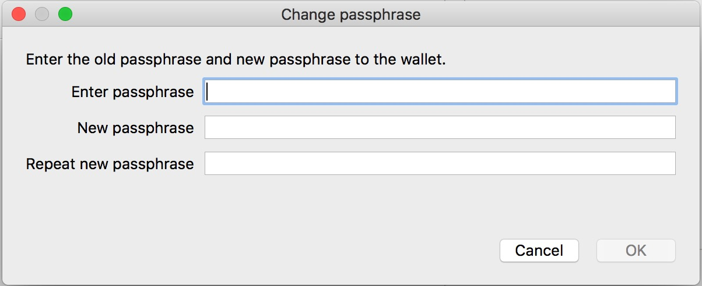

# Encrypt & Unlock Qtum Wallet

If you have don't know how to deploy a Qtum node, or you don't know how to launch a Qtum Wallet, please refer to following instructions to install wallet first:

* For command line users：《[Guidance of Qtum Deployment](../Guidance-of-Qtum-Deployment-and-RPC-Settings.md)》
* For GUI wallet users(common users)：[https://eco.qtum.org/wallet](https://eco.qtum.org/wallet)

**Important: After you encrypt wallet or change your pin code, please remember to backup your wallet again!!!**

Please do all following things after you successfully installed and run a Qtum wallet: 

## Encrypt Wallet

### For command line users

qtum-cli command to encrypt wallet：

```
./qtum-cli encryptwallet "yourpassword"
```

note that `yourpassword`is the user defined password, please remember it or you might lost your QTUM.

After encryption, all fund security related actions (like send QTUM, staking, or dump private keys) will all requiring a password. 

### For GUI wallet users

Choose`Setting-Encrypt Wallet` in the menu, as following:


create a new passphrase and repeat it. The wallet will restart after encryption.


After restart, there will be a lock flag shown on the bottom of the wallet, which means it is already encrypted (locked) ：


## Unlock wallet

### For command line users

qtum-cli command to unlock wallet：

```
./qtum-cli walletpassphrase "yourpassword" 99999
```

the first argument `yourpassword` is the passphrase you set when encryption, while the second is required unlock time, the unit is second (like 99999 seconds here).

After unlocking, you can send QTUM or do other fund security related actions.

If you only want to unlock the wallet for staking, please use ：

```
./qtum-cli walletpassphrase "yourpassword" 99999 true
```

The first two arguments are the same, and the 3rd argument `true` means you only want to unlock for staking. After doing this, you can start staking, but other fund security related actions like sending QTUM or dumping private key still need your passphrase to fully unlock your wallet first. 

### For GUI wallet users

Go to “Settings-unlock wallet” to unlock your wallet：


enter passphrase to unlock wallet. If you choose `For staking only`, it means you only unlock the wallet for staking，but other fund security related actions like sending QTUM or dumping private key are still forbidened. So please unselect `For staking only` if you want to fully unlock your wallet.


After unlocking, the lock flag on the bottom will switch to unlocked.

## Change passphrase

### For command line users

command for change passphrase:

```
./qtum-cli walletpassphrasechange "oldpassphrase" "newpassphrase"
```

`oldpassphrase` is the old passphrase you set last time，and `newpassphrase` is the new passphrase you want set。

### For GUI wallet users

Go to “Setting-Change Passphrase” to change passphrase：


enter old passphrase and new one to complete modification：


