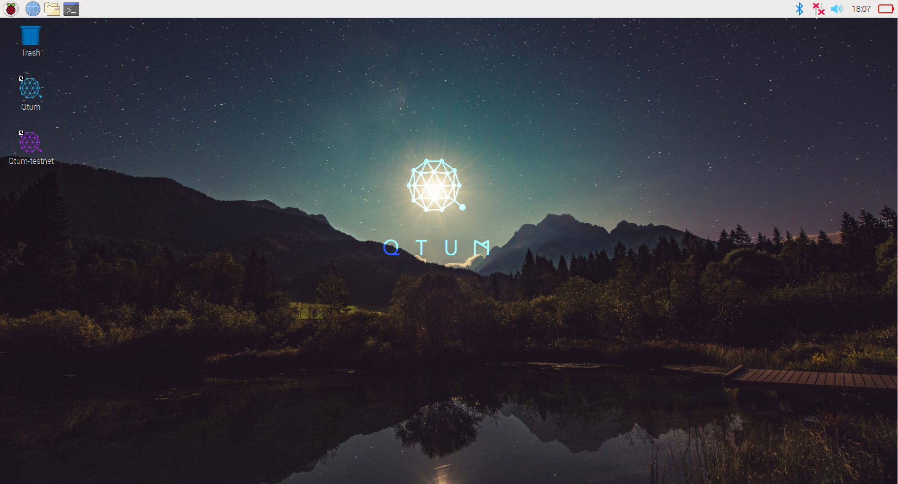
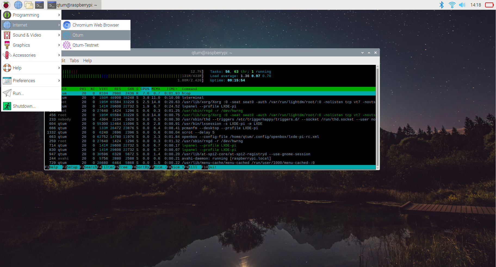
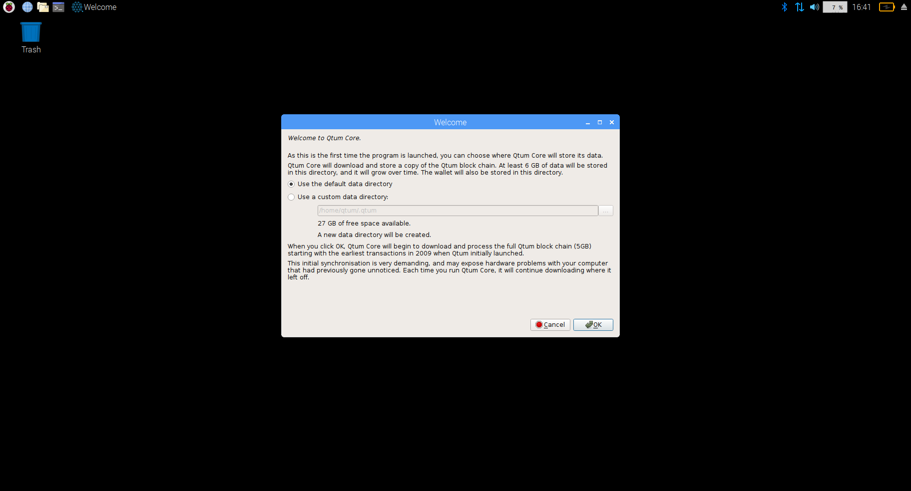
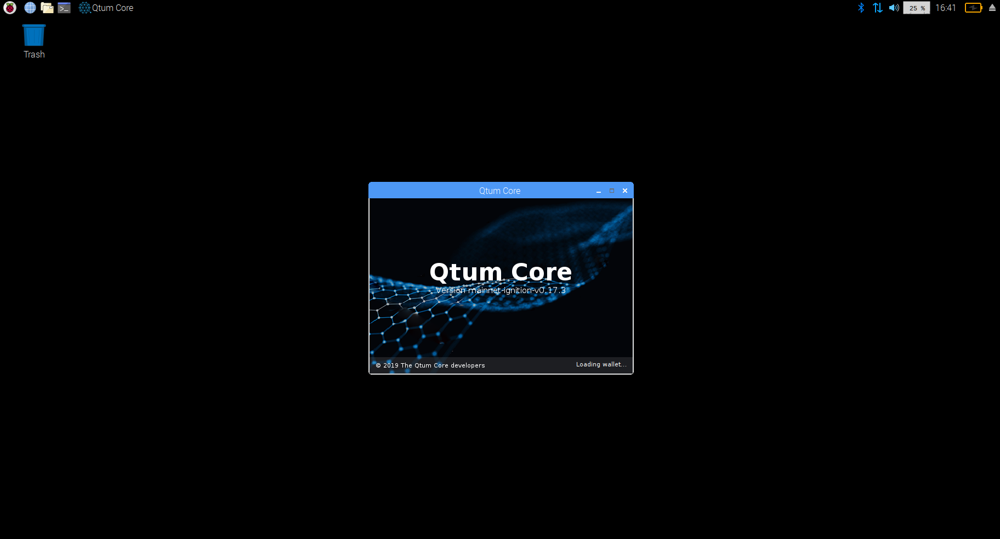
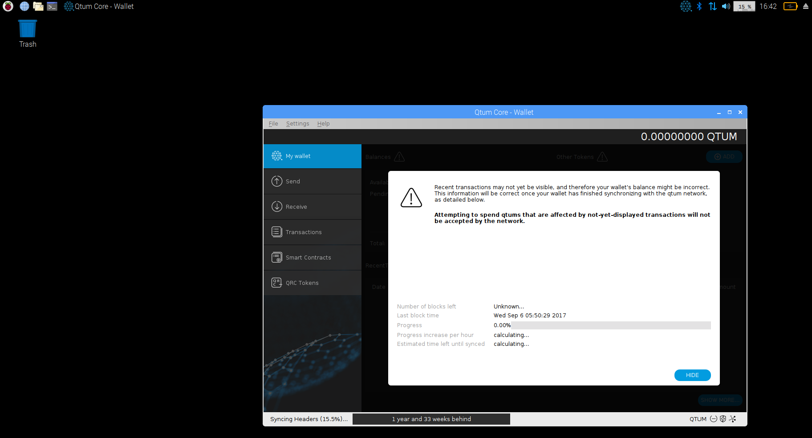
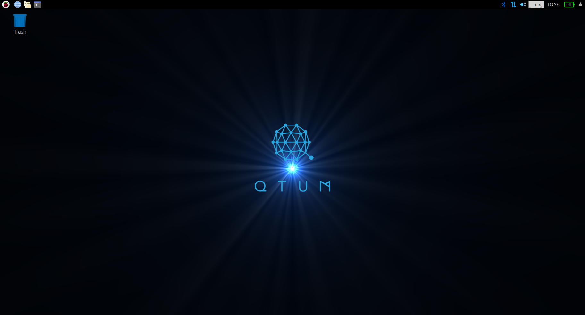
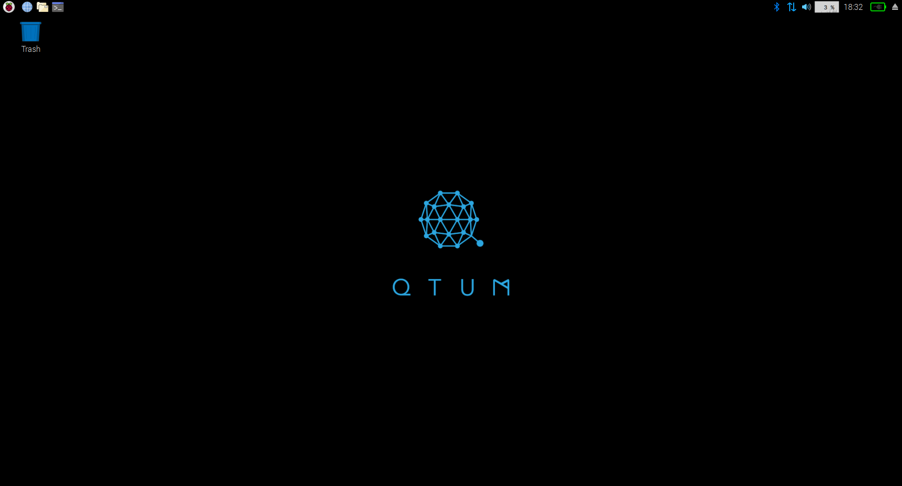

# Qtum on Raspberry Pi


1. [Getting a Stakebox](#Getting a Stakebox)
2. [Downloading Qtum Raspbian](#Downloading Qtum Raspbian)
3. [Screenshots of Qtum Raspbian](#Screenshots of Qtum Raspbian)
4. [Installing Qtum via Qtum Raspbian repository](#Installing Qtum via Qtum Raspbian repository) **(only needed if you're not using a Qtum stakebox or not using the Qtum Raspbian image)**
5. [Setting up a firewall in Raspbian](#Protecting access with a basic firewall)
6. [Launching Qtum daemon](#Launching Qtum daemon)
7. [Encrypting wallet](#Encrypting wallet)
8. [Staking](#Staking)
9. [Backup](#How to backup to a separate device)


### Getting a Stakebox

There's several ways to run Qtum on a Raspberry Pi, perhaps the easiest way is to just get a **Qtum Stakebox**, you can order from here: 

<https://www.stakebox.org/products/qtum-stakebox>


### Downloading Qtum Raspbian

If you don't want to buy or already own a stakebox and just want to get the latest version of Raspbian with Qtum preinstalled with the official Qtum Repository, then you can download the Raspbian images yourself:

# New Qtum Raspbian Release!


## This new release brings huge changes, including optimized releases for Raspberry Pi 4 and the Raspberry Pi Zero.


### Changelog:

- Upgrade to Debian Buster 10 release
- Cleaned up unnecessary files
- Improved Zram and increased Swap file up to 2GB (RPI Zero)
- Qtum 0.18.0 
- Testnet launcher available
- Qtum launchers are now in the "Internet"  section on the applications menu
- Bugfixes
- Release version of solar 1.0 included 
- More wallpapers

### Download links:


#### Qtum Raspbian (Recommended from Raspberry Pi 2 - Raspberry Pi 4)

https://raspbianimages.s3.amazonaws.com/2019-08-19-Qtum-Raspbian.zip

https://raspbianimages.s3.amazonaws.com/2019-08-19-Qtum-Raspbian-lite.zip


#### Qtum PiZero (Recommended for Raspberry Pi 1 and Pi Zero)

https://raspbianimages.s3.amazonaws.com/2019-08-19-Qtum-PiZero.zip

https://raspbianimages.s3.amazonaws.com/2019-08-19-Qtum-PiZero-lite.zip


### "Burning" the Qtum Raspbian image to your SD card

Please watch this video tutorial which shows how to download, burn and use your Qtum Raspbian image

https://www.youtube.com/watch?v=0W6NlIk7Tgw&t=0s


### IMPORTANT NOTE!

**Qtum raspbian** default user is **qtum** and default password is **qtum1234**. You will need to enter these on first login and you will be asked by the login system to change your password immediately, please make sure to use a strong password!


### Screenshots of Qtum Raspbian



In order to launch Qtum, we need to go to the menu and go to other -> Qtum



Once you click on it, you'll see the following screen mentioning some details regarding disk usage and disk space available on your raspberry pi.



After clicking ok, your Raspberry Pi will begin syncing!



Syncing on your raspberry can take anything from a couple of hours to a day, please be patient.



The Qtum raspbian image has also some cool wallpapers to choose from:








## Installing Qtum via Qtum Raspbian repository

If you're using a **"normal"** raspbian install, you can add the Qtum repository to install Qtum and keep with updates easily!

### Install dirmngr & apt-transport https

```sudo apt install -y dirmngr apt-transport-https  ```

### Add qtum public key

`sudo apt-key adv --keyserver keyserver.ubuntu.com --recv-keys BF5B197D`

### Adding repository to your APT sourcess

`sudo su` - Sudo to root first

` echo "deb https://repo.qtum.info/apt/raspbian/ jessie main" >> /etc/apt/sources.list`
or
` echo "deb https://repo.qtum.info/apt/raspbian/ stretch main" >> /etc/apt/sources.list`

This will add the repository to your APT sources file.

### Refreshing APT sources and installing Qtum

`sudo apt update && sudo apt install qtum`

By doing this, we'll update our sources and install Qtum on our raspberry Box, which can act now as a staking server/node.


## Changing default password

**PLEASE NOTE: you will only really need to do this if you're using a "clean" raspbian image; you won't need to do this if you're using a Stakebox or the official Qtum Raspbian**

This option is recommended for security reasons, the default password on the pi is well known, it's highly recommended to change it upon first login. 

To change just type: `passwd`

The prompt will ask you to write and repeat the new password to confirm.


## Protecting access with a basic firewall

Well, our raspberry is only for staking, there's no need to have all those ports open, let's close everything we don't need and only allow access to necesary services.

First, let's install UFW (uncomplicated firewall) which is an easy-to-use interface for iptables

`sudo apt install ufw`

Once this is installed, we proceed with access permissions, we will define which ports will be accessible. Let's check first what's open:

`sudo ufw status` This should show something like this: 

`Status: active`

`To               Action      From`

`--               ------      ----`

`22               ALLOW       Anywhere`


#### Ok so it's time to start closing down access, type the following:

`sudo ufw default deny incoming`

`sudo ufw allow 3888/tcp`

Here we've defined the basics, closing down everything except port 3888 and 3889 which are used by Qtum to function.

If you're using SSH, it's recommended to only allow access from local network.

`sudo ufw allow from 196.168.0.0/24 to any port 22`

## Binaries available on Raspberry Pi

- qtumd
- qtum-cli
- qtum-qt 
- qtum-tx

## Launching Qtum daemon

All we need to do to launch the Qtum daemon is type:
`qtumd -daemon`

As soon as you type this, the wallet will create the wallet.dat file among other files (if they’re not already there). The wallet will run and begin syncing instantly from the other Blockchain nodes, this can take a few hours to complete so you can go ahead and have some coffee and let it synchronize.

## Launching Qtum-Qt

If you're using Raspberry Pi desktop interface, all you need to do is navigate to the applications menu->other->qtum-qt

## Encrypting wallet

We can encrypt the wallet at any time, it's better to do it before we go any further.

To do this, type the following on the command line:

`qtum-cli encryptwallet yourpassword`

This will encrypt the wallet which in turn closes the daemon, you'll see the following message:

`wallet encrypted; Qtum server stopping, restart to run with encrypted wallet.` If you alreadby backed up before encrypting, you **need to make a new backup.**

`qtum-cli getaccountaddress` "" -> Right after launching the daemon, you can obtain your wallet address by typing this.

You can send Qtum coins to the address we just obtained from the daemon, please remember that those transactions require at least 500+ confirmations before they become mature enough for staking.

## Staking

Now that we've waited until we have at least 501 confirmations on our received transaction, we are elligible for staking, however, if our wallet is encrypted (which we did for security reasons) we won't be able to stake, let's open our wallet for staking using the command line!.

`qtum-cli walletpassphrase password 999999999 true`

The above command will unlock the walet for 31.6 Years! that should be enough for now. Please note, this will not unlock your backup, only the wallet that's running right now.

Now that we've unlocked our wallet, we need to wait until we have more than 501 confirmations to be elligible for staking, if we already do, it's a matter of time which will vary depending on the network weight vs your wallet's weight.

## Checking Balance

To check your balance, type qtum-cli getinfo this will show general information, including your available balance and balance in staking

## Check transactions

To check your transactions (incoming and outgoing) type qtum-cli listtransactions

## Check staking info

To check Qtum's staking information, type qtum-cli getstakinginfo

## Staking tips

Staking really depends on network weight vs your wallet’s weight which is based on the amount of coins you have, higher weight increases your chances of staking a block.

If you have a large amount of coins, it’s a good idea to split those up in separate transactions, for instance, if you have 10.000 QTUM, it’s better to send 10 transactions of 1000 QTUM each to your wallet, each one generates a UTXO input which will take part in staking. This optimizes the staking process and works much better than just one large 10.000 QTUM input.

If you want to split your coins into different addresses inside your Rasbperry Pi wallet, type the following to obtain new addresses inside your wallet: qtum-cli getnewaddress Each time you type this, you’ll get a new address, QTUM can generate any amount of addresses you want, but please keep in mind, if you do go over 100 new address, you might want to make a new backup of your wallet.


## Updating wallet

We’re always launching new updates, sometimes it’s to add new features or fix bugs. In any case, updating is a breeze, all you have to do is type
` sudo apt update && sudo apt upgrade -y `


## How to backup to a separate device

Making a backup in Raspberry is simple, you only need to copy the wallet.dat file, but how do you export this to another device? 

First, we'll download Filezilla, which is an easy to use and secure FTP/SFTP server

[https://filezilla-project.org](https://filezilla-project.org/)


Installing is just like any other windows app.


When the installer finishes, we launch Filezilla and are greeted with this screen, let's proceed and add our previously created ssh-key

We go into Edit -> Settings -> SFTP. This will give us the following screen in which we will be able to import our SSH key.


Please note that Filezilla only accepts the private key which is created when the ssh-key was generated.

Here we've already added the ssh key, now we can log into our server


we enter our Raspberry Pi ip address + username (root in this case), leave a blank password because we're using ssh-key to login 

Just press ok when prompted, and you'll be able to log in. 


Here we can see the /root/ folder of our Raspberry Pi, this is where our wallet runs and has the wallet stored in /root/.qtum we can go ahead and double click the folder which will show us the following: 

Now all we need to do is scroll down to wallet.dat, right click and select download from the list. This will download the wallet.dat file to our computer, we've successfully backed up our Qtum wallet!.

 
