# Staking Qtum on FreeBSD

FreeBSD is a very powerful operating system, it has a great history of reliability, security and stability. Here we show how it can be used to stake Qtum in a secure way.

## Isolating Qtumd in a FreeBSD jail

FreeBSD jails are a very powerful feature, in summary, your jail instance is more protected as it's like having a separate OS just for Qtum with reduced privileges. 

Here's a good read on Jails:  https://www.freebsd.org/doc/handbook/jails.html

### FreeBSD version used for this tutorial is 11.2, download it from the official FreeBSD mirrors:

https://www.freebsd.org/doc/handbook/eresources-web.html

### Installing FreeBSD

Install FreeBSD as normal, however, the following hardening settings are recommended during install:

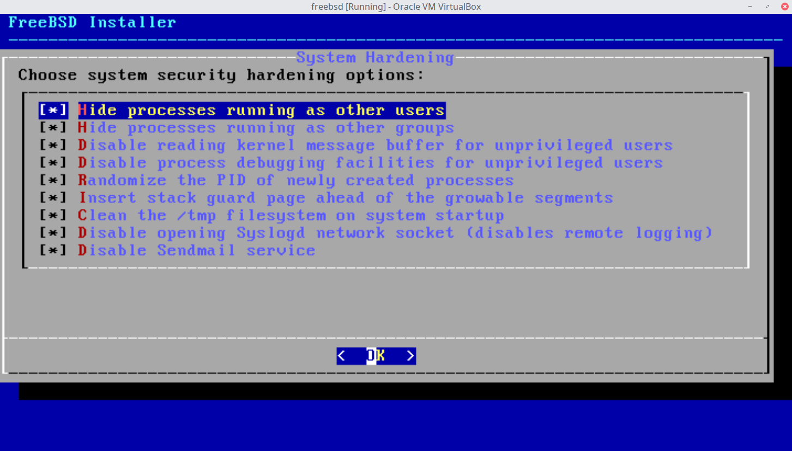

### Create user

Create a user with permissions "operator wheel"

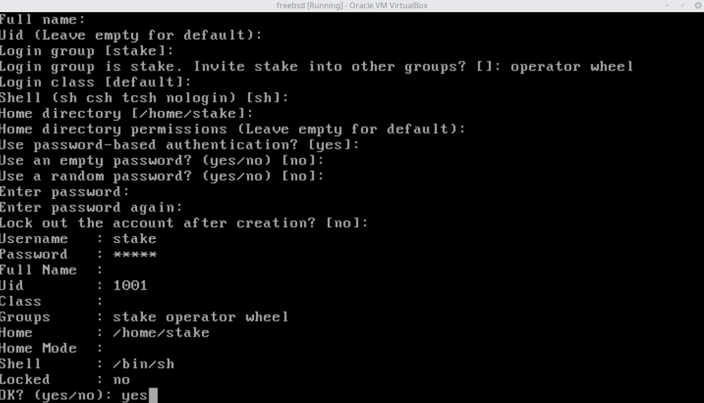

Please remember to do all these commands as root

## Host:

### /etc/sysctl.conf

### Allow sockets and upgrades in jail

`security.jail.allow_raw_sockets=1`

`security.jail.chflags_allowed=1`

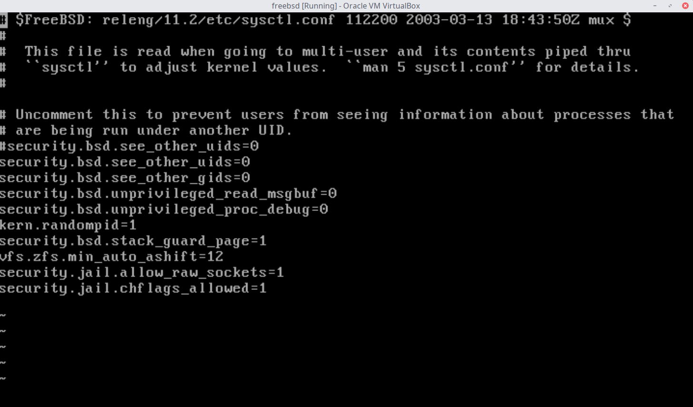

### /etc/rc.conf

`firewall_enable="YES"`

`firewall_quiet="YES"`

`firewall_type="workstation"`

`firewall_myservices="22 3888"`

`firewall_allowservices="any"`

`firewall_logdeny="YES"`

` jail_enable="YES"`

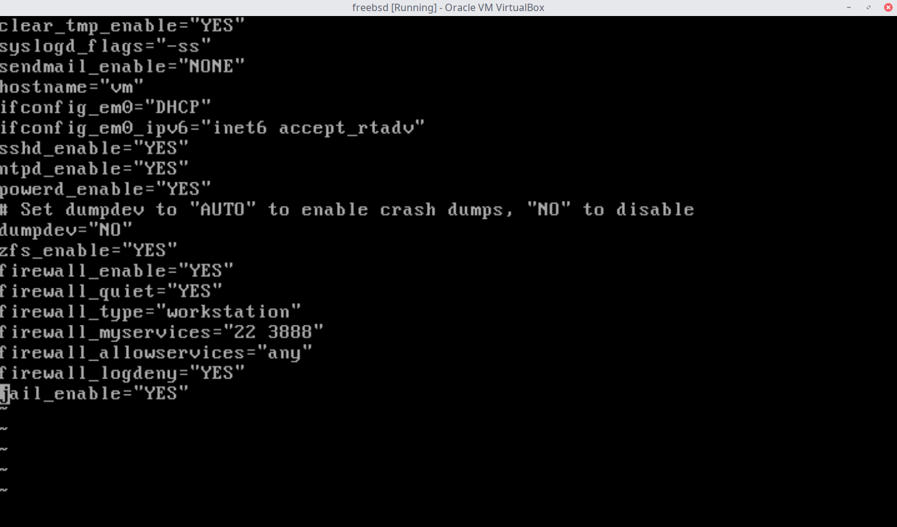

Notice that we've added some settings for firewall, these will enable IPFW and basic settings to secure our Jail, allowing only ports 22(ssh) and 3888(Qtum) to be accessed.

### Resource limits for Jails

### /boot/loader.conf

`kern.racct.enable=1`

` jail_enable="YES"`

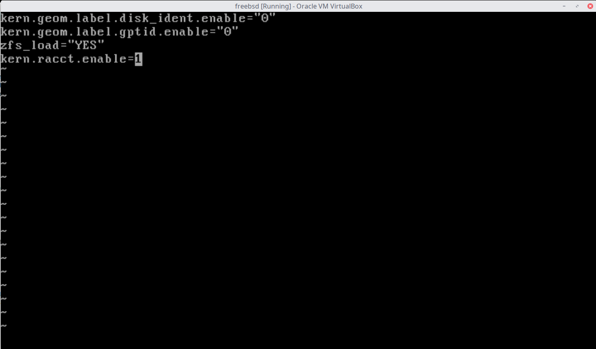

### Creating our Jail for staking

`zfs create -o mountpoint=/jail  zroot/jail`

**(Change zroot for whatever name you chose for your zfs pool)**  

`zfs create -o mountpoint=/jail/nextcloud  zroot/jail/qtum`

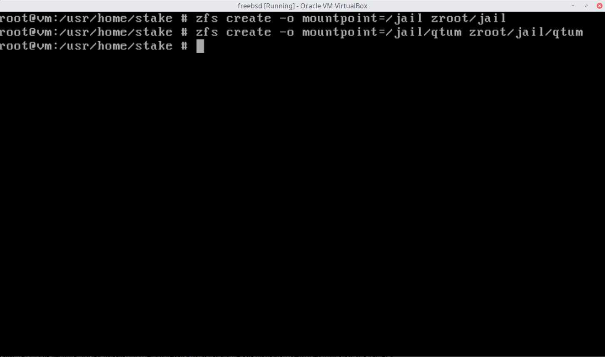

### Now we've created our jail for staking Qtum, let's fetch and install FreeBSD on it!

`cd /jail/qtum/ && fetch -o  - http://ftp.freebsd.org/pub/FreeBSD/releases/amd64/11.2-RELEASE/base.txz | tar --unlink -xpJf - -C /jail/qtum `

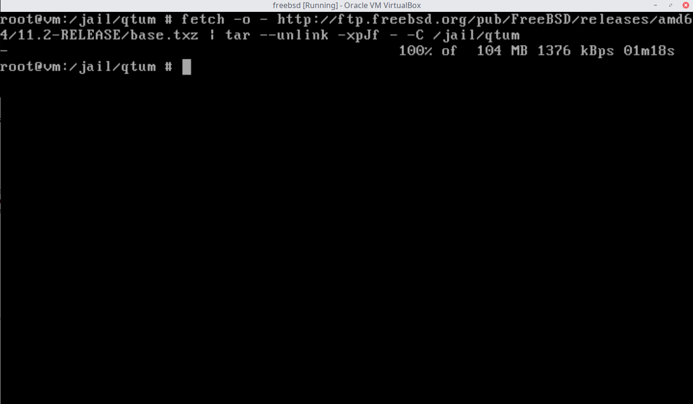

#### We've now installed FreeBSD into /jail/qtum

Typing ls /jail/qtum/ should show the filesystem of our Qtum FreeBSD Jail

Now, let's create the jail configuration file:

### /etc/jail.conf

`qtum {`
`  host.hostname = qtum.local;`
`  ip4.addr = 192.168.0.99;`
`  interface = em0;`
`  path = /jail/qtum;`
`  exec.start = "/bin/sh /etc/rc";`
`  exec.stop = "/bin/sh /etc/rc.shutdown";`
`  exec.clean;`
`  mount.devfs;`
`  allow.raw_sockets;`
`  allow.sysvipc;`
`}`

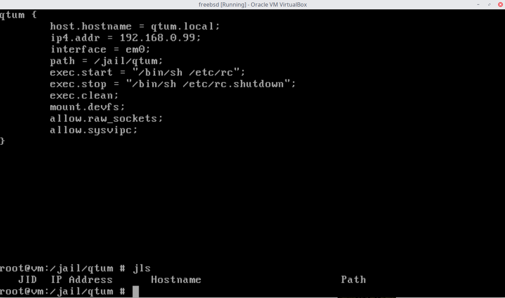

Ok now it's time to launch our jail!

` service jail start qtum `

#### We've just started our Qtum jail, We can now get into our Qtum jail to finish configuration, install Qtum and launch the wallet.

` jexec qtum /bin/csh`

` cp /usr/share/zoneinfo/America/YOURTIMEZONE/ /etc/localtime  `
This is very important, if the time info is incorrect, we'll produce orphan blocks or will be unable to sync

Create our basic /etc/rc.conf for our Qtum Jail

## Qtum Jail:

### /etc/rc.conf

`syslogd_flags="-s -s"`
`sshd_enable=YES`
`clear_tmp_enable=YES`
`clear_tmp_X=YES`
`extra_netfs_types=NFS`
`dumpdev=NO`
`update_motd=NO`
`keyrate=fast`

`sendmail_enable=NONE`

`sendmail_submit_enable=NO`
`sendmail_outbound_enable=NO`
`sendmail_msp_queue_enable=NO`

## Add dns nameservers to /etc/resolv.conf

`echo "nameserver 8.8.8.8" >> /etc/resolv.conf`
`echo "nameserver 8.8.4.4" >> /etc/resolv.conf`

## Installing Qtum

Now that we've got our jail up and running, we need to install Qtum.
There's 2 options on doing this, we can use the pkg repository or the powerful FreeBSD ports which are usually updated faster:

#### pkg repository

`pkg update -f`
`pkg install -y qtum`

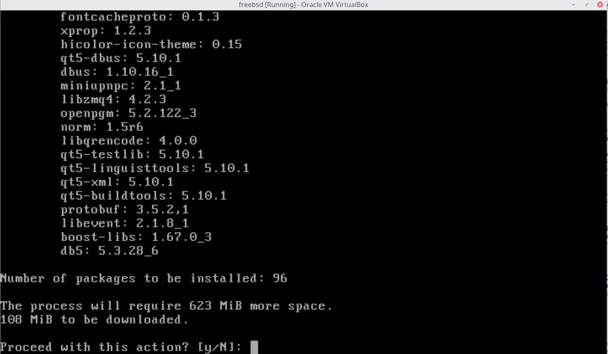

#### FreeBSD ports

`portsnap fetch extract`
`cd /usr/ports/net-p2p/qtum && make install clean`

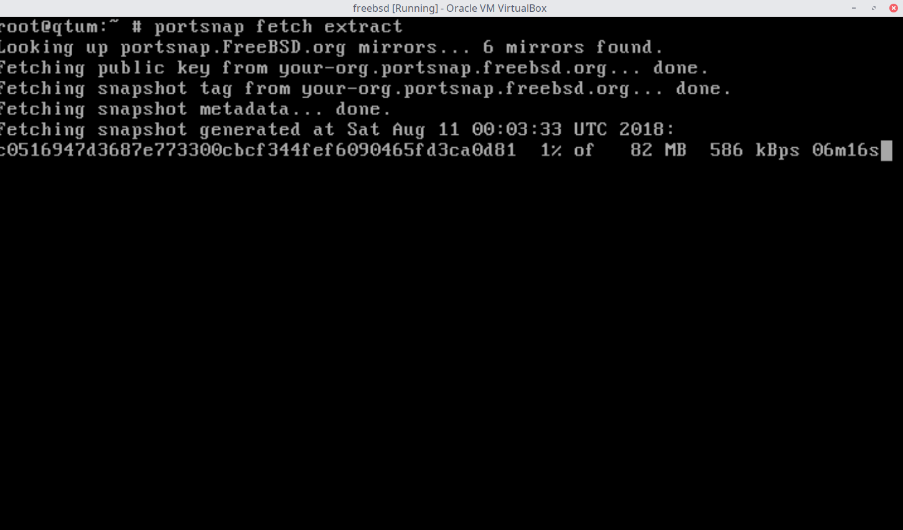The above will ask for a lot of configuration options, it might be better to use make config-recursive to set all options before compiling.
If you want to use default settings just type `cd /usr/ports/net-p2p/qtum && make install clean BATCH="YES"`

### Running Qtum

Launching Qtum is just like in any other *NIX operating system, however there's a minor difference here due to how FreeBSD jails work. First, we need to create a qtum.conf file with the following contents:

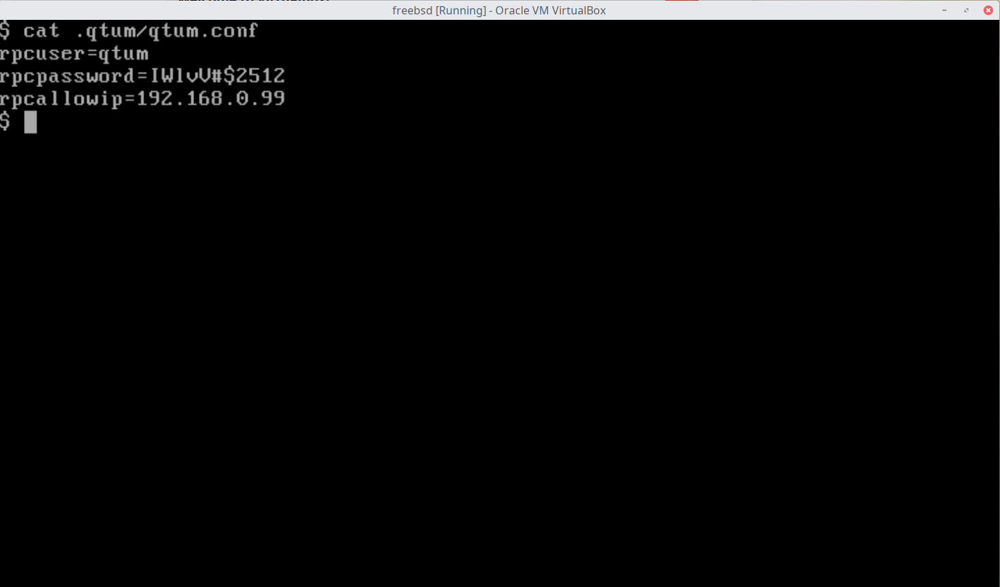

This config is necessary, otherwise calling the daemon will return errors.

Then we can launch with`qtumd -daemon`

## Security tips

- Set up firewall on host (you cannot setup a firewall inside a jail) and enable only the ports you need (22 and 3888) This is done in the host rc.conf at the top of this tutorial
- Disable history, this will completely disable console history and it's a way to help secure your staking box, type the following on your FreeBSD console: ` unset history; unset savehist `
- Secure SSH: 
  1. Disable password authentication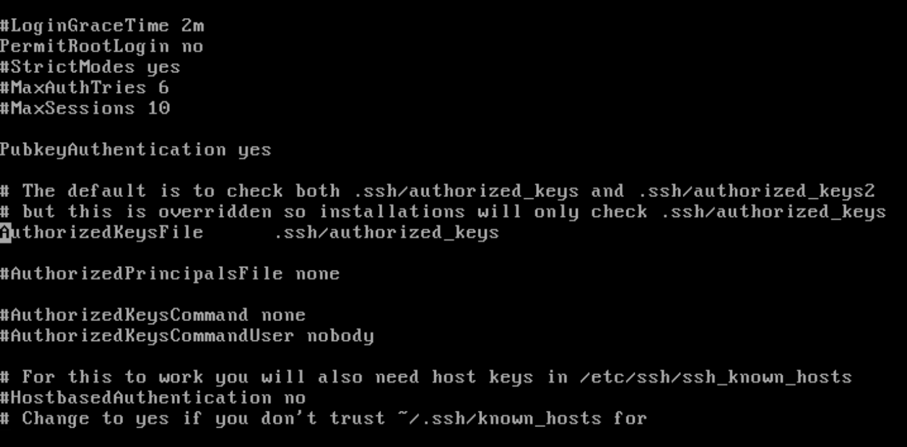
     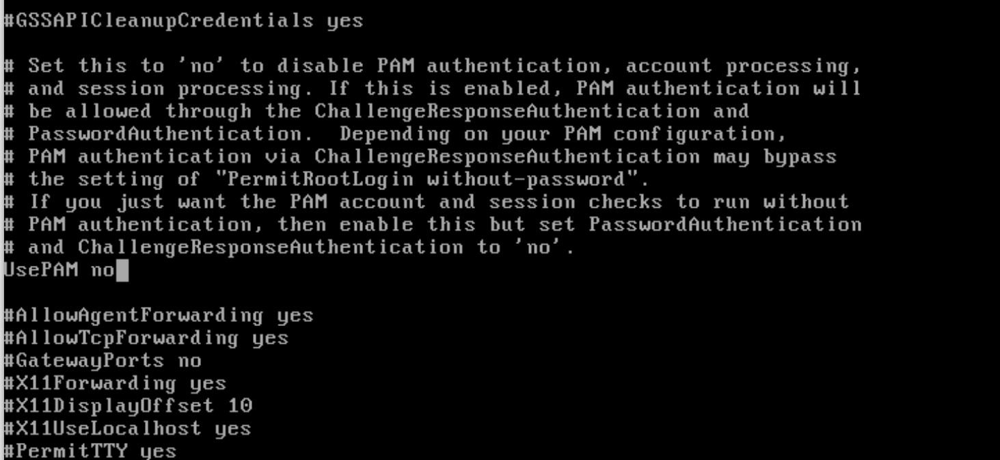

2. If using the FreeBSD box on your home network, force it to listen on local network only.

