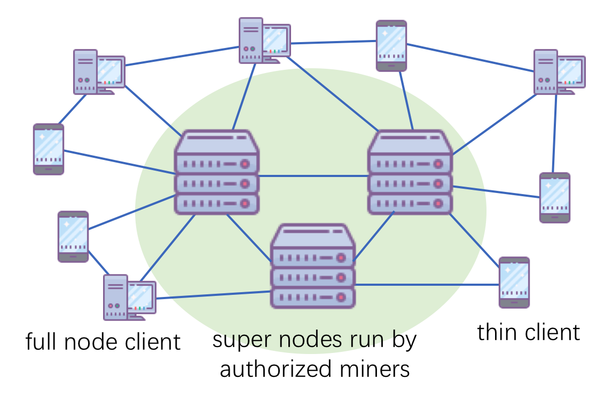
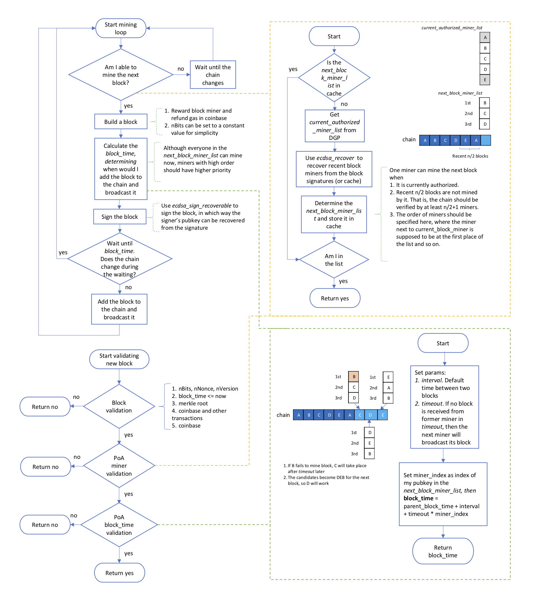
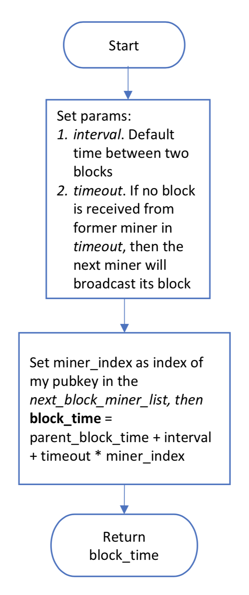
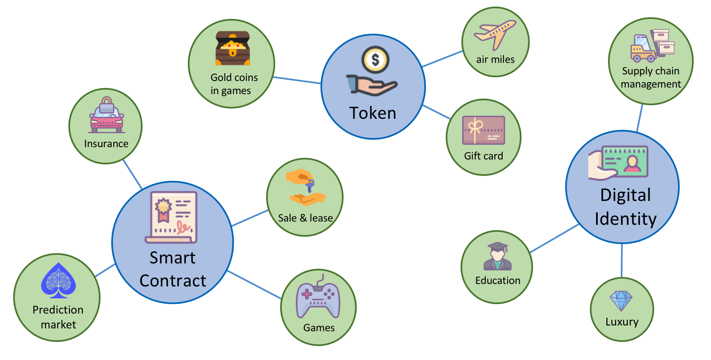

# QtumX技术白皮书

# 背景

Qtum企业版，也叫QtumX，旨在开发一套联盟链系统。在联盟链中，共识机制只能由一小部分授权的节点来执行，而读和发交易仍旧对所有节点开放。

Qtum被市场证明了是一条成功的公有链，所以企业版仍会基于Qtum的框架进行开发。一些新的模块将会引入，从而满足以下的企业需求：
1. 高TPS（Transactions Per Second）和较短的确认时间
2. 可定制的系统参数，保证系统适用于各种不同的环境

# 联盟链

## 联盟链和PoA共识

诸如比特币、以太坊和量子链之类的区块链称之为公有链。它们没有任何接入限制。任何人都可以在上面创建区块和发送交易。在这样的区块链中，诞生了很多共识算法，例如PoW（Proof of Work）和PoS（Proof of Stake），用于保证大量用户能够对“谁可以创建下一个区块”达成共识。这些区块链被认为是完全去中心化的。

而联盟链通常称之为“部分去中心”的。在联盟链中，共识的过程只能由少部分授权的节点进行执行。例如，一个由三家游戏公司组成的联盟打算运行一条区块链，用于记录它们旗下的所有游戏中的金币。它们中每一家运行一个节点，用于验证交易和创建区块。游戏玩家则能够读取区块和发送交易。在这种情况下，只有这3个授权的节点需要对创建区块的过程达成共识。

联盟链的共识算法通常叫做PoA（Proof of Authority）。PoW的原理是计算一个复杂的数学问题，PoS的原理是持有大量的链上代币，而PoA则是使用一张授权矿工地址列表来决定哪些节点可以创建新的区块。当一条链被列表中的大多数矿工签名后，这条链就可以视作为一条永久的链。这样做会更为高效和安全，因为矿工变少了且矿工是可信的。

## 一种BFT共识算法
这里我们介绍一种PoA共识算法，该算法将会在Qtum企业版中供用户进行选择。这是一种BFT（Byzantine Fault Tolerance）类型的算法，通常被称作拜占庭将军问题的书面协议解法[1]。在这个算法中，每个区块需要由其矿工进行签名，且大于等于一半的矿工节点挂掉之后系统才会停止制造新的区块。我们首先将整个算法的流程图贴出来，然后再在下文中详细阐述其逻辑。

为了便于解释这个算法，我们假定有5个授权的矿工，A、B、C、D、E，它们的公钥存储在一个有序列表中。这个列表在区块链最开始的时候初始化，然后可以通过智能合约进行更新修改。我们再次假定在区块链高度*h1*的时候，*current_authorized_miner_list*是*[pubkey_A, pubkey_B, pubkey_C, pubkey_D, pubkey_E]*。然后这5个矿工会轮流创建一个新的区块，从*h1*直至*h2*，如下图。

当创建新的区块的时候，矿工会用*secp256k1_ecdsa_sign_recoverable*函数来签名这个区块，然后将签名结果附加到区块中。通过这种方式，其他节点可以用*secp256k1_ecdsa_recover*函数从区块中恢复出矿工的公钥来，从而通过和*current_authorized_miner_list*进行比对来验证该矿工是否有权创建区块。

当一条链被大多数矿工签名之后，这条链可以被视作为一条永久的链。例如在上图中，从创世区块到*h3*高度的链是一条永久的链，因为它已经被它接下来的几位矿工D、E和A签名了。如果任何矿工想要在高度*h3*下面制造分叉，这一分叉则无法被绝大多数矿工所认同。

因此，至少需要*n/2+1*位矿工来保持共识算法的正常运行，这里*n*是总共授权的矿工数量并且*n/2*是整数除法。在我们的例子中*n=5*，所以至少需要3个矿工节点。即，节点A、B、C可以在D、E节点关闭的时候继续创建新的区块。然后产出的区块链就会如同ABCABC，是一条有效的链。这一共识算法可以简单定义如下：

> 一个矿工在以下情况可以创建新的区块
> 1.  它当前是被授权的；
> 2.  最近的*n/2*个块不是由它创建的。

根据这一定义，我们可以获得真正被允许创建下一个区块的矿工。只需要从*current_authorized_miner_list*中去掉最近*n/2*个块的矿工即可。例如，在高度*h2*上，*next_block_miner_list*可以计算如下。

尽管B、C、D都可以创建下一个区块，但必须指定它们的优先级顺序，从而避免它们之间为下一个区块而竞争，并且保证区块链被尽可能多的矿工签名验证过。因此，我们把*next_block_miner_list*定义为一个有序列表，处于列表第一位的是在*current_authorized_miner_list*中排在当前矿工之后的那位矿工，并且以此类推。在我们的例子中，B、C、D的顺序展示在了上图中。

当优先级顺序确定了之后，接下来计算分配给每个矿工的*block_time*。在*next_block_miner_list*中排序更前的矿工会分配更早的*block_time*。每个矿工使用分配的*block_time*来创建新的区块，并且在*block_time*到来前保持等待状态。如果等待过程中没有接收到新的区块，矿工就会在等待结束时广播自己创建的区块。*block_time*的计算方式如下。

通过这种方式，如果一个矿工未能成功广播新的区块，下一个矿工会在*timeout*时间之后取代它。这里举一个例子。矿工B在产出高度为*h2+1*的区块时挂了。随后，B在*next_block_miner_list*中的下一位C，将会在*parent_block_time*的*interval+timeout*时间之后，广播其创建的新区块。

## 用DGP进行授权矿工的存储与更新
DGP（Decentralized Governance Protocol）[2]是Qtum中应用的一项技术。它允许使用区块链上的智能合约去在线修改区块链的参数，这样就不会造成软分叉或是硬分叉。

DGP工作的方式非常直接了当。首先，由DGP的一名管理员发起提议去改变某一个系统参数。随后，所有的DGP管理员可以对这个提议进行投票。如果提议收到了足够多的赞同票，则该提议中的参数修改生效。然后，提议的内容会被存储在区块链上，方便区块链的软件去获取。

很明显，DGP非常适合用来存储和更新PoA中的授权矿工列表。授权的矿工可以看做是一个公钥的列表，这个列表可以通过配置文件初始化，然后再通过DGP进行更新。但这里我们需要对DGP做一些修改从而让矿工的更新过程更加安全。

> 由DGP更新的矿工列表需要至少延迟*n/2+1*个块之后真正生效。

这里，*n*是更新前列表的长度，*n/2*是整数除法。这一机制保证了矿工列表的更新操作会在其成为区块链上的永久记录之后才真正生效。否则，如果更新操作可以被另一个分叉否定掉，则列表更新前的矿工很有可能在这个分叉下继续挖矿甚至产生硬分叉。

## 区块奖励
和PoS中的coinstake奖励机制不同，PoA中的矿工会仍旧使用coinbase进行奖励。Qtum中合同运行产生的退款，也会加入到coinbase中。这样，PoA中的coinbase会包含一个或多个输出。第一个输出是给矿工的，金额等于区块奖励和区块中所有交易的交易费。其余的输出则是合同退款。

# 可定制的系统参数
我们会尽可能地让企业版中的大多数参数都是可配置的。因此系统可以轻松应用于各种各样的环境中。部分可配置的参数如下。

1. 创世区块：*block_time*, coinbase；
2. 网络参数：*pchMessageStart*, *seeds*；
3. PoA共识算法的参数：*interval*, *timeout*；
4. 区块奖励参数：initial value, *nSubsidyHalvingInterval*

# 应用前景

联盟链广阔的应用前景是对QtumX价值的最好体现。这里我们列举了QtumX的3类应用场景。更多的应用方式还需要在实践中进行探索。

## 积分系统
作为一个区块链系统，最基本的应用就是token。使用QtumX可以轻松建立起一套积分的存储和交易系统。这里所指的积分，可以是：
1.  游戏中的金币
2.  商场、超市发放的储值卡
3.  航空公司赠送的里程

这些使用场景对高TPS、快速的交易确认和手机端轻节点等特性都是有强烈需求的。QtumX完全可以满足这些需求。

## 合约系统
基于智能合约的区块链应用同样值得期待。通过QtumX，把原本书面的合同、规则用智能合约的形式记录在区块链上，让合同变得透明、难以篡改、易于验证。使用联盟链部署和运行合约，仅需要开发者提供服务器资源作为矿工节点，而不需要消耗高额的公链代币。同时，QtumX支持EVM，这使得合约的兼容性更好。

基于智能合约的应用举例如下：
1.  预测市场
2.  保险，例如车险、财产险
3.  房屋租售
4.  游戏

## 数字身份
把一些重要的信息记录在区块链上，用于公众的验证和追溯。使用联盟链的方式实现，同样可以节省成本。具体的使用场景包括：
1.  供应链管理：追踪商品从生产、运输、到零售的过程
2.  教育记录：记录学生的课程、学校经历
3.  奢侈品：记录奢侈品的信息用于购买者验证

# 参考文献

[1] Driscoll, Kevin; Hall, Brendan; Sivencrona, Håkan; Zumsteg, Phil. "Byzantine Fault Tolerance, from Theory to Reality". 

[2] [qtum.org](https://qtum.org/en/blog/qtum-s-decentralized-governance-protocol). "Qtum's Decentralized Governance Protocol". 